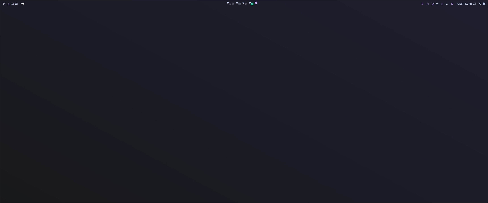

# nixos

<div align="center">
    
    
</div>

> [!IMPORTANT]
> I do not recommend anyone to use it since it is heavily personalised to my needs.
> I share this repository to simplify tracking, sharing of errors and config parts, as well of ease of access on new setups.



## Synopsis

```
.
├── bin
│   └── helper scripts for installation, VMs and diagnostics
├── dots
│   └── dotfiles, e.g. Firefox, MPV, Oh My Posh and wallpapers
├── home-manager
│   ├── apps
│   │   └── application configuration and user packages
│   ├── desktop
│   │   └── Hyprland and desktop environment configuration
│   ├── development
│   │   └── editors, SDKs, shell and development tools
│   └── automatically loaded Home Manager modules
├── hosts
│   ├── home
│   │   └── machine identity, boot and hardware configuration for home desktop
│   ├── lenovo-yoga-7x-pro
│   │   └── machine identity, boot and hardware configuration for laptop
│   ├── img
│   │   └── NixOS configuration for ISO generation
│   └── shared host and graphical configuration
├── lib
│   └── shared helpers, including profile-aware module loading
├── modules
│   └── automatically loaded NixOS modules for services, apps and drivers
├── patches
│   └── local source patches
├── pkgs
│   └── custom package definitions
├── profiles
│   ├── home
│   │   └── home-only NixOS and Home Manager settings
│   └── lenovo-yoga-7x-pro
│       └── laptop-only NixOS and Home Manager settings
├── secrets
├── flake.nix
└── justfile
```

Files below `modules` and `home-manager` use a typed module descriptor to declare where they load:

```nix
{
  profiles = [ "default" ];

  # ...
}
```

`default` loads on both systems. `home` and `lenovo` load only on matching host. 
Multiple profile values may be used on one file. `profiles` accepts only valid profile names.

`profiles` is an internal typed option. Module functions, `imports`, and custom `options` retain normal behavior.

## Secrets

To edit secrets, please run:

```bash
export EDITOR=vim
sops secrets/secrets.yaml
```

If this is your first setup, please read the README in secrets first!

## Create a Live-ISO

Live-ISOs are great thing.
They can be used to test simple and not persistant things in a VM or being used to boot from.

```bash
just home-iso
sudo cp result/iso/nixos-*-x86_64-linux.iso nixos.iso
```
